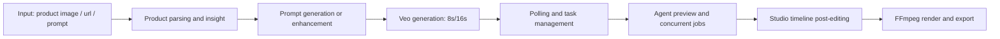
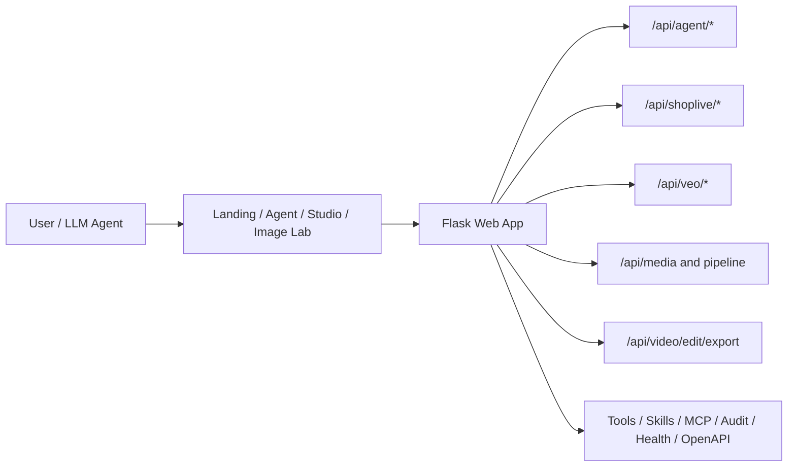

# Shoplive

> AI video generation and editing workspace for ecommerce marketing.  
> One pipeline from product understanding to export-ready videos.


English (current) | [简体中文 README](./README.md)

---

> 🎉 **Project Origin**: This project was incubated at **Shoplazza's internal Spring Festival AI Innovation Hackathon**. The goal was to prove one end-to-end loop — *product understanding → AI video generation → in-browser editing → export* — within a tight timeframe.
>
> It is therefore a **full-demo-ready but not-yet-production-grade** system. Deployment, persistence, rate-limiting, and E2E testing are all still at "demo level". See 👉 [Known Limitations / Gap to Production](#known-limitations--gap-to-production).
>
> **PRs from newcomers are very welcome!** 🙌 Bug fixes, tests, features, architecture overhauls — every one moves it closer to a real product.

---

## Table of Contents

- [Why Shoplive](#why-shoplive)
- [Core Capabilities](#core-capabilities)
- [Feature Matrix](#feature-matrix)
- [UI Preview](#ui-preview)
- [End-to-End Flow](#end-to-end-flow)
- [Architecture](#architecture)
- [Project Structure](#project-structure)
- [Requirements](#requirements)
- [Quick Start](#quick-start)
- [API Quick Reference](#api-quick-reference)
- [Run Tests](#run-tests)
- [Known Limitations / Gap to Production](#known-limitations--gap-to-production)
- [Roadmap](#roadmap)
- [Contributing](#contributing)
- [License](#license)

## Why Shoplive

- **End-to-end workflow**: product parsing -> prompt generation -> Veo generation -> timeline editing -> export
- **Production-minded**: boundary validation with Pydantic, audit traceability, health checks, OpenAPI sync
- **Multi-workbench design**: Landing / Agent / Studio / Image Lab for creation-to-delivery collaboration
- **UX + reliability**: streaming responses, backoff polling, concurrent jobs, timeout continuation, graceful fallbacks
- **Agent-native infra**: Tool Registry + Skills + MCP adapter for LLM discoverability and orchestration

## Core Capabilities

- Product insight extraction from images and ecommerce links
- Dual crawler engines (`requests` + Playwright) with platform adapters
- Prompt generation and enhancement for Veo 3.1
- 8s/16s generation, polling, inline playback, and segment concat
- Post-editing (speed, color, text mask, BGM mix) and export
- Agent infrastructure: validation middleware, tools manifest, skills, audit chain, OpenAPI

## Feature Matrix

| Module | What it does | Status |
| --- | --- | --- |
| Landing | Fast requirement input and handoff to Agent | ✅ Ready |
| Agent | Insight, prompt enhancement, 8s/16s generation, concurrent tasks | ✅ Ready |
| Studio | Timeline editing, async render, progress/cancel, optimization advice | ✅ Ready (MVP+) |
| Image Lab | Product-related image generation and pipelines | ✅ Ready |
| Backend API | Agent / Shoplive / Veo / Media / Edit APIs | ✅ Ready |
| Agent Infra | Tools / Skills / MCP / Audit / OpenAPI | ✅ Ready |

## UI Preview

Place screenshots under `docs/images/` and keep these names:

- `docs/images/landing.png`
- `docs/images/agent.png`
- `docs/images/studio.png`
- `docs/images/image-lab.png`

## End-to-End Flow



## Architecture



## Project Structure

```text
shoplive/
  README.md
  README.en.md
  backend/
    run.py
    web_app.py
    schemas.py
    validation.py
    audit.py
    tool_registry.py
    skills.py
    mcp_adapter.py
    common/helpers.py
    api/
    tests/
  frontend/
    pages/
    scripts/
    styles/
    assets/
```

## Requirements

- Python `3.10+`
- `ffmpeg` and `ffprobe`
- Playwright Chromium
- Google Cloud credentials (for Veo/Image)
- LiteLLM API key

## Quick Start

```bash
cd shoplive
python3 -m venv .venv
source .venv/bin/activate
pip install -U pip
pip install -r requirements.txt
playwright install chromium
cp .env.example .env
python3 -m shoplive.backend.run
```

Default URL: `http://127.0.0.1:8000`

## API Quick Reference

- Agent:
  - `POST /api/agent/shop-product-insight`
  - `POST /api/agent/image-insight`
  - `POST /api/agent/chat` (`stream=true` supported)
- Veo:
  - `POST /api/veo/start`
  - `POST /api/veo/status`
  - `POST /api/veo/extract-frame`
  - `POST /api/veo/concat-segments`
- Edit:
  - `POST /api/video/edit/export`
  - `POST /api/video/timeline/render`
- Infra:
  - `GET /api/tools/manifest`
  - `GET /api/skills`
  - `POST /api/mcp/rpc`
  - `GET /api/audit/stats`
  - `GET /api/health`
  - `GET /api/openapi.json`

## Run Tests

```bash
python3 -m pytest backend/tests/ -v
```

## Known Limitations / Gap to Production

As a hackathon-incubated MVP, this project currently proves *one* working loop. Before it can safely serve real traffic (multi-tenant, 24/7, multi-worker), the items below need real work.

We list them openly so **any newcomer can pick one and open a PR**. Items marked 🫱 are *high-leverage*; items marked 🐣 are *newcomer-friendly* entry points.

### 🔴 P0 — Production blockers

- 🫱 **No production serving**: `backend/run.py` runs Flask's dev server directly — no Gunicorn/uWSGI, no Dockerfile, no CI/CD. Must land before any real deploy.
- 🫱 **All state lives in process memory**: `_chain_jobs` (veo_api), timeline job queue, audit queue, TTL caches are all in-process `dict/deque`. A restart wipes them; multi-worker deployments can't share state. Plan: Redis for task state + SQLite/Postgres for audit & long-term records.
- 🫱 **`web_app.py` is a god module**: ~730 lines, 13+ route registrations, system-prompt constants and OpenAPI generation all in one file; `agent_api.py` even re-imports `app` dynamically, creating a circular-import hazard. Refactor to `create_app()` + per-domain blueprints.

### 🟠 P1 — Reliability / cost / quality

- 🫱 **No rate limit / quota on LLM endpoints**: `/api/agent/chat`, `/api/agent/run` etc. have no throttling — a malicious script can burn Vertex quota in minutes. Add IP/session token-bucket.
- 🫱 **Tests are all mocks, zero E2E**: 377 tests `patch` out Vertex/Grok/Jimeng/GCS. The critical path "image → script → Veo → ffmpeg" has no integration coverage. Past bugs like the `text_overlay` vs `maskText` field mismatch slipped right through mocks.
- 🐣 **Inconsistent upstream timeout / retry policies**: Veo / Grok / LiteLLM / Jimeng each carry their own settings (15s+90s / 90s / 1200s). Consolidate into one decision layer so "what retries, how many times, what backoff" is defined in one place.
- 🐣 **No type contract on the frontend**: Backend has `schemas.py` + `/api/openapi.json`, but the plain-JS frontend has no codegen. Field renames only blow up at runtime. Add `openapi-typescript` or maintain `.d.ts`.

### 🟡 P2 — Tech debt / UX debt

- 🐣 **Primitive secret management**: `.env` is plain text — no secret manager, no rotation
- 🐣 **Scattered scraper adapters**: `backend/scraper/adapters/` has 10+ per-platform scripts with no shared framework; adding a new platform is expensive
- 🐣 **No global state management on the frontend**: no Redux/Pinia; modules communicate via callbacks + window events, which gets fragile fast
- 🐣 **No structured logging config**: `DEBUG=1` is too noisy, off is too silent — on-call debugging suffers
- 🐣 **Agent tool arg schemas only validated at the HTTP edge**: runtime tool calls surface type mismatches as exceptions; add a runtime validator inside `tool_registry.py`
- 🐣 **Hard dependency on local ffmpeg-full**: `drawtext` / subtitles need brew `ffmpeg-full`; a Docker image as the standard execution environment would remove that friction

### Tips for PRs

- **Green first**: run `python3 -m pytest backend/tests/ -v` and confirm baseline is green before you start
- **Small steps**: one PR = one thing; ship code + tests + a PR description that says *why*, not *what*
- **Talk first when unsure**: open an Issue to align on direction — much cheaper than discovering a wrong turn mid-dig
- **Read the trail**: `CLAUDE.md` accumulates past pitfalls (written for an AI, readable by humans too)

---

## Roadmap

- [ ] Upgrade timeline rendering backend options (ffmpeg / cloud render)
- [ ] Build a richer task center (filter, retry, diagnostics)
- [ ] Add E2E UI automation for Agent + Studio
- [ ] Add Docker/Compose deployment profiles
- [ ] Publish formal OSS license and contributor templates

## Contributing

1. Fork and create a branch: `feat/<topic>`
2. Ensure tests pass before PR
3. Include context, change list, validation steps, and risk notes in PR description
4. Update docs when API behavior changes

## License

This repository is currently for internal development/demo and is **All Rights Reserved** by default.  
If open-sourcing later, add a formal `LICENSE` file and update this section.

