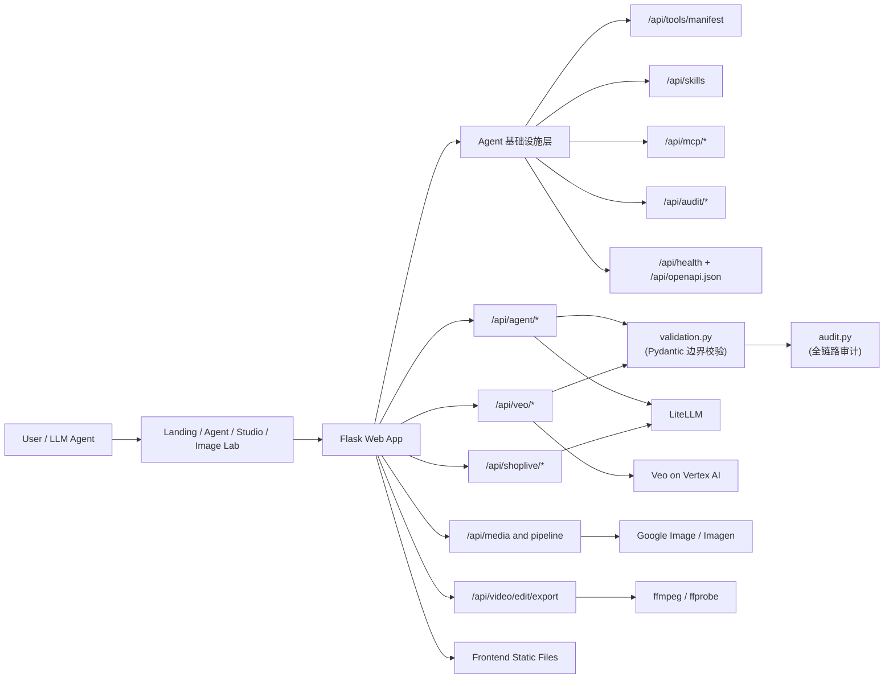

# Shoplive

Shoplive 是一个面向电商营销场景的 AI 视频生成与编辑工作台。  
用户可以通过商品图、商品链接或文本提示词，快速完成「商品理解 -> 提示词生成 -> Veo 视频生成 -> 在线二次编辑导出」的完整链路。

## 核心能力

- 商品信息解析：支持图片与商品链接提取商品名、卖点、风格等信息
- 主流电商抓取：支持 requests + Playwright 双引擎抓取，并按平台适配解析规则
- 智能提示词：自动生成/增强 Veo 3.1 可用的电商视频提示词
- 视频生成：支持 8s/16s 生成、状态轮询、inline 播放与拼接回传
- 二次编辑：对已生成视频进行调色、变速、文字蒙版、BGM 混音后导出
- 多工作台模式：Landing / Agent / Studio / Image Lab 覆盖从创意到交付全过程
- **Agent Tools 基础设施**：Pydantic 类型校验中间件、Tool Registry（智能召回）、Skills 技能编排、MCP 协议适配、全链路审计（trace_id + 调用链）、OpenAPI 自动生成

## 典型使用场景

- 电商素材制作：新品上架、活动会场图视频化、详情页短视频
- 运营快速出片：同一商品批量生成不同风格与比例素材（16:9 / 9:16）
- 跨区域投放：基于目标市场快速调整场景、语气与表达风格
- 演示与路演：从输入商品信息到输出成片，全链路可现场演示

---

## 技术架构



---

## 项目结构

```text
shoplive/
  README.md
  更新.md                    # 四轮优化完整记录
  conftest.py                # pytest sys.path 配置
  backend/
    run.py                   # 启动入口
    app_factory.py           # 应用工厂
    web_app.py               # Flask 主应用 + 路由注册 + 静态托管
    briefing.py              # 业务规则、脚本与提示词编排
    infra.py                 # 鉴权、代理、公共参数解析（含 _TokenCache）
    schemas.py               # Pydantic 请求验证模型（10 个 schema）
    validation.py            # validate_request 装饰器（边界校验中间件）
    audit.py                 # 全链路审计（AuditLogger + trace context）
    tool_registry.py         # LLM 友好工具注册表（10 工具 + 智能召回）
    skills.py                # 技能编排层（4 个 Skill + 操作说明书）
    mcp_adapter.py           # MCP JSON-RPC 协议适配器
    async_executor.py        # 并行图片预取（ThreadPoolExecutor）
    common/helpers.py        # 通用工具（解析、模型调用、媒体处理）
    api/
      agent_api.py           # 商品洞察、Agent 对话（含审计 + Pydantic 校验）
      shoplive_api.py        # 视频工作流（校验/脚本/提示词）
      veo_api.py             # Veo 任务提交与状态查询（含审计 + Pydantic 校验）
      media_api.py           # 生图与组合管线接口
      video_edit_api.py      # ffmpeg 导出接口
    tests/
      test_schemas.py        # Pydantic schema 测试（39 tests）
      test_audit.py          # 审计日志测试（23 tests）
      test_validation.py     # 验证装饰器测试（23 tests）
    scraper/                 # 电商链接抓取与解析
      fetchers.py            # requests / Playwright 抓取
      models.py              # FetchArtifact / ParseResult
      adapters/              # 平台解析适配器（shein/amazon/taobao/jd...）
  frontend/
    pages/                   # 多页面入口
    scripts/                 # entry/modules/shared
    styles/                  # 各页面样式
    assets/                  # 静态素材
```

---

## 环境要求

- Python `3.10+`
- `ffmpeg` 和 `ffprobe`（视频导出必需）
- Playwright Chromium（商品页面 JS 渲染抓取）
- 可用的 Google Cloud 凭据（Veo / Image）
- LiteLLM API Key（用于提示词相关能力）

建议在仓库根目录（`shoplive` 上一级）执行。

## 快速开始

### 1. 创建虚拟环境并安装依赖

```bash
cd "/Users/huangshaozheng/Desktop/ai创新挑战赛"
python3 -m venv .venv
source .venv/bin/activate
pip install -U pip
pip install -r shoplive/requirements.txt
playwright install chromium
```

### 2. 配置环境变量

```bash
cp shoplive/.env.example shoplive/.env
```

至少确认（示例）：

- `LITELLM_API_KEY` 已配置
- Google 凭据文件可访问（默认读取 `shoplive/credentials/...json`，也可通过 `GOOGLE_APPLICATION_CREDENTIALS` 覆盖）

常用环境变量说明：

| 变量名 | 必填 | 说明 |
| --- | --- | --- |
| `LITELLM_API_KEY` | 是 | 文本模型调用密钥（脚本/提示词相关） |
| `LITELLM_API_BASE` | 否 | LiteLLM 服务地址 |
| `LITELLM_MODEL` | 否 | 默认文本模型名（如 `azure-gpt-5`） |
| `GOOGLE_APPLICATION_CREDENTIALS` | 否 | Google 服务账号 JSON 路径（可覆盖默认 key） |
| `HOST` | 否 | Flask 监听地址，默认 `127.0.0.1` |
| `PORT` | 否 | Flask 监听端口，默认 `8000` |
| `DEBUG` | 否 | 调试开关，默认开启 |

### 3. 启动服务

```bash
python3 -m shoplive.backend.run
```

自定义端口：

```bash
PORT=8010 python3 -m shoplive.backend.run
```

默认地址：`http://127.0.0.1:8000`

### 4. 打开页面

- Landing：`/`
- Agent：`/pages/agent.html`
- Studio：`/pages/studio.html`
- Image Lab：`/pages/image-lab.html`

---

## 关键接口速览

### Agent 基础设施（新增）

| 端点 | 方法 | 说明 |
|------|------|------|
| `/api/tools/manifest` | GET | LLM 工具清单（支持 `?skill=` / `?tags=` 筛选） |
| `/api/skills` | GET | 技能摘要列表（轻量） |
| `/api/skills/<id>` | GET | 完整技能定义 + 操作说明书（按需加载） |
| `/api/mcp/tools` | GET | MCP 协议工具列表 |
| `/api/mcp/rpc` | POST | MCP JSON-RPC 调用入口 |
| `/api/audit/stats` | GET | 全链路调用统计（总次数、错误率、平均耗时） |
| `/api/audit/recent` | GET | 最近 N 条审计记录（`?limit=20`） |
| `/api/audit/trace/<id>` | GET | 按 trace_id 查询完整调用链 |
| `/api/health` | GET | 服务健康检查 + 组件状态 |
| `/api/openapi.json` | GET | 自动生成的 OpenAPI 3.0.3 规范（与代码始终同步） |

### Agent & 商品洞察

- `POST /api/agent/shop-product-insight`
- `POST /api/agent/image-insight`
- `POST /api/agent/chat`（支持 `stream=true` 的 SSE 增量输出）

`shop-product-insight` 说明：
- 已接入平台识别与适配器：`shein`、`amazon`、`ebay`、`aliexpress`、`temu`、`etsy`、`walmart`、`tiktok-shop`、`taobao`、`jd`（未命中时走 `generic`）
- 抓取引擎自动路由：常规先 `requests`，需要 JS 渲染或质量不足时自动切 `playwright`
- 返回可观测字段：`source`、`confidence`、`fallback_reason` 以及 `insight.fetch_source`、`insight.fetch_confidence`
- 额外返回图片与评论提取元信息：`insight.main_image_confidence`、`insight.review_extraction_method`

### Shoplive 工作流

- `POST /api/shoplive/video/workflow`（`validate / generate_script / build_export_prompt`）
- `POST /api/shoplive/video/prompt`

### Veo 生成

- `POST /api/veo/start`
- `POST /api/veo/chain`（自动链式扩展，支持 8/16/24 秒）
- `POST /api/veo/extend`（基于已有视频做单次延展）
- `POST /api/veo/status`
- `POST /api/veo/extract-frame`（支持 `gcs_uri` 或 `video_data_url` 抽帧）
- `POST /api/veo/concat-segments`（支持 `gcs_uri` 或 `video_data_url` 拼接）
- `POST /api/veo/generate-16s`（后端并行版；前端当前默认走串行拼接链路）

### 生图与管线

- `POST /api/google-image/generate`
- `POST /api/shoplive/image/generate`
- `POST /api/pipeline/banana-to-veo`
- `POST /api/pipeline/google-image-to-veo`

### 视频编辑导出

- `POST /api/video/edit/export`
- `POST /api/video/timeline/render`（MVP：按时间线片段渲染并导出）
- 导出访问：`GET /video-edits/<filename>`

## 接口调用示例

### 1) 提交 Veo 任务

```bash
curl -sS -X POST "http://127.0.0.1:8000/api/veo/start" \
  -H "Content-Type: application/json" \
  -d '{
    "project_id":"gemini-sl-20251120",
    "model":"veo-3.1-fast-generate-001",
    "prompt":"生成一条6秒电商产品展示视频，镜头平稳推近，突出材质细节与高级感",
    "sample_count":1,
    "veo_mode":"text",
    "duration_seconds":6,
    "aspect_ratio":"16:9"
  }'
```

### 2) 查询 Veo 状态

```bash
curl -sS -X POST "http://127.0.0.1:8000/api/veo/status" \
  -H "Content-Type: application/json" \
  -d '{
    "project_id":"gemini-sl-20251120",
    "model":"veo-3.1-fast-generate-001",
    "operation_name":"<替换为 start 接口返回值>"
  }'
```

### 2.1) 链式生成 16 秒（8s 基础 + 1 次 extend）

```bash
curl -sS -X POST "http://127.0.0.1:8000/api/veo/chain" \
  -H "Content-Type: application/json" \
  -d '{
    "project_id":"gemini-sl-20251120",
    "model":"veo-3.1-fast-generate-001",
    "prompt":"生成一条16秒电商产品广告，保持统一产品主体、镜头语言和光线风格",
    "sample_count":1,
    "target_total_seconds":16,
    "aspect_ratio":"16:9",
    "storage_uri":"gs://gemini_video_shoplive/chain/",
    "extend_retry_max":1,
    "extend_retry_delay_seconds":2
  }'
```

说明：
- 单段 Veo 仍使用 4/6/8 秒生成规则
- 16/24 秒通过链式扩展自动编排（8 秒为基础片段）
- 链式接口会返回每一段的 operation 与视频输出，便于排障
- 扩展段默认自动重试，降低偶发失败（`extend_retry_max` 最大 2）

### 2.2) 抽取视频尾帧（支持 inline 视频）

```bash
curl -sS -X POST "http://127.0.0.1:8000/api/veo/extract-frame" \
  -H "Content-Type: application/json" \
  -d '{
    "project_id":"gemini-sl-20251120",
    "position":"last",
    "video_data_url":"data:video/mp4;base64,<省略>"
  }'
```

### 2.3) 拼接两个 8s 视频为 16s（支持 inline 视频）

```bash
curl -sS -X POST "http://127.0.0.1:8000/api/veo/concat-segments" \
  -H "Content-Type: application/json" \
  -d '{
    "project_id":"gemini-sl-20251120",
    "video_data_url_a":"data:video/mp4;base64,<省略>",
    "video_data_url_b":"data:video/mp4;base64,<省略>"
  }'
```

### 3) 导出编辑后视频

```bash
curl -sS -X POST "http://127.0.0.1:8000/api/video/edit/export" \
  -H "Content-Type: application/json" \
  -d '{
    "video_url":"<可访问的视频链接>",
    "edits":{
      "speed":1.0,
      "sat":8,
      "temp":4,
      "vibrance":6,
      "maskText":"新品上新",
      "x":50,
      "y":88
    }
  }'
```

### 3.1) 按时间线渲染导出（MVP）

```bash
curl -sS -X POST "http://127.0.0.1:8000/api/video/timeline/render" \
  -H "Content-Type: application/json" \
  -d '{
    "source_video_url":"data:video/mp4;base64,<省略>",
    "duration_seconds":8,
    "include_audio":true,
    "tracks":[
      {"label":"Video","track_type":"video","segments":[{"left":0,"width":40},{"left":40,"width":60}]}
    ]
  }'
```

### 4) 查询工具清单（Agent 发现）

```bash
# 全部工具
curl "http://127.0.0.1:8000/api/tools/manifest"

# 仅视频生成相关工具
curl "http://127.0.0.1:8000/api/tools/manifest?skill=video_generation"
```

### 5) 获取技能操作说明书

```bash
# 列出所有技能（轻量）
curl "http://127.0.0.1:8000/api/skills"

# 获取「商品链接 → 成片」端到端流程指南
curl "http://127.0.0.1:8000/api/skills/product_to_video"
```

### 6) 服务健康检查

```bash
curl "http://127.0.0.1:8000/api/health"
# 返回: audit 统计、token_cache 命中率、tools/skills 数量
```

### 7) 请求校验错误示例

所有 API 使用 Pydantic 在系统边界做类型校验，失败时返回：

```json
{
  "ok": false,
  "error": "Request validation failed: 'product_url' — Value error, product_url must be a valid http/https URL",
  "error_code": "VALIDATION_ERROR",
  "recovery_suggestion": "Fix 'product_url': ... See GET /api/openapi.json → components/schemas/ProductInsightRequest.",
  "validation_errors": [{"field": "product_url", "message": "...", "type": "value_error"}]
}
```

---

## 运行测试

```bash
# 安装 pytest（仅需一次）
pip install pytest

# 运行全部测试（97 tests，~0.6s，无需任何外部服务）
python3 -m pytest backend/tests/ -v
```

测试覆盖：

| 文件 | 测试数 | 覆盖内容 |
|------|--------|---------|
| `test_schemas.py` | 45 | Pydantic schema 的枚举、边界、必填校验（含 timeline render 请求） |
| `test_audit.py` | 23 | AuditLogger buffer/stats/trace 过滤/文件持久化/线程安全 |
| `test_validation.py` | 23 | validate_request 装饰器正常路径 + 13 种错误路径 |
| `test_helpers_timeline.py` | 6 | 时间线片段归一化、边界过滤、片段数量限制 |

---

## 演示流程（推荐）

1. 在 Landing 输入商品诉求或上传参考图进入 Agent
2. 在 Agent 自动补齐商品信息并生成视频
3. 调用 Veo 轮询完成后，在对话区预览成片
4. 打开视频编辑面板进行调色/BGM/蒙版编辑
5. 导出并获取可访问链接用于演示

---

## 常见问题

- **生成成功但无可播放链接**：检查 `veo/status` 返回中的 `signed_video_urls` 与 `inline_videos`
- **视频可见但无法播放**：优先检查 `/api/veo/play` 是否返回 200；若 403 通常是 GCS 权限不足（服务账号需具备目标 bucket 的对象读取权限）
- **导出失败**：优先确认本机是否安装 `ffmpeg` / `ffprobe`
- **文字蒙版未生效**：当前 ffmpeg 可能不含 `drawtext` 过滤器，系统会自动降级但仍可导出其它编辑项
- **模型调用超时**：检查代理与凭据设置，或降低任务复杂度重试
- **商品链接解析质量低**：查看返回的 `fallback_reason`，若为 `anti_bot` 或 `weak_html` 建议更换代理、稍后重试或改用可访问地区网络

## 部署与安全建议

- 请勿将 `.env`、凭据文件、私钥提交到代码仓库
- 生产环境建议将密钥由密钥管理服务注入，不直接落盘
- 建议在 API 网关层增加鉴权与限流，避免接口滥用
- 对外演示时建议使用最小权限服务账号，并定期轮换密钥

---

## 许可证

本仓库当前用于内部开发与演示，默认 **保留所有权利（All Rights Reserved）**。  
未经作者书面许可，不得复制、分发、修改或用于商业用途。

若后续计划开源，建议新增正式 `LICENSE` 文件并在此处声明开源协议（例如 MIT / Apache-2.0）。

