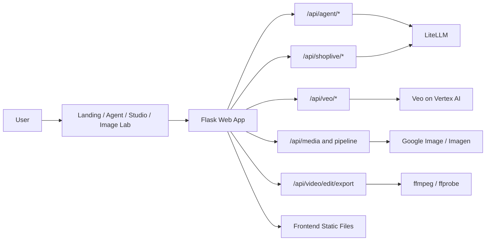

# Shoplive

Shoplive 是一个面向电商营销场景的 AI 视频生成与编辑工作台。  
用户可以通过商品图、商品链接或文本提示词，快速完成「商品理解 -> 提示词生成 -> Veo 视频生成 -> 在线二次编辑导出」的完整链路。

## 核心能力

- 商品信息解析：支持图片与商品链接提取商品名、卖点、风格等信息
- 智能提示词：自动生成/增强 Veo 3.1 可用的电商视频提示词
- 视频生成：调用 Veo 接口提交任务并轮询获取可播放结果
- 二次编辑：对已生成视频进行调色、变速、文字蒙版、BGM 混音后导出
- 多工作台模式：Landing / Agent / Studio / Image Lab 覆盖从创意到交付全过程

## 典型使用场景

- 电商素材制作：新品上架、活动会场图视频化、详情页短视频
- 运营快速出片：同一商品批量生成不同风格与比例素材（16:9 / 9:16）
- 跨区域投放：基于目标市场快速调整场景、语气与表达风格
- 演示与路演：从输入商品信息到输出成片，全链路可现场演示

---

## 技术架构



---

## 项目结构

```text
shoplive/
  README.md
  backend/
    run.py                   # 启动入口
    app_factory.py           # 应用工厂
    web_app.py               # Flask 主应用 + 路由注册 + 静态托管
    briefing.py              # 业务规则、脚本与提示词编排
    infra.py                 # 鉴权、代理、公共参数解析
    common/helpers.py        # 通用工具（解析、模型调用、媒体处理）
    api/
      agent_api.py           # 商品洞察、Agent 对话
      shoplive_api.py        # 视频工作流（校验/脚本/提示词）
      veo_api.py             # Veo 任务提交与状态查询
      media_api.py           # 生图与组合管线接口
      video_edit_api.py      # ffmpeg 导出接口
  frontend/
    pages/                   # 多页面入口
    scripts/                 # entry/modules/shared
    styles/                  # 各页面样式
    assets/                  # 静态素材
```

---

## 环境要求

- Python `3.10+`
- `ffmpeg` 和 `ffprobe`（视频导出必需）
- Playwright Chromium（商品页面 JS 渲染抓取）
- 可用的 Google Cloud 凭据（Veo / Image）
- LiteLLM API Key（用于提示词相关能力）

建议在仓库根目录（`shoplive` 上一级）执行。

## 快速开始

### 1. 创建虚拟环境并安装依赖

```bash
cd "/Users/huangshaozheng/Desktop/ai创新挑战赛"
python3 -m venv .venv
source .venv/bin/activate
pip install -U pip
pip install -r shoplive/requirements.txt
playwright install chromium
```

### 2. 配置环境变量

```bash
cp shoplive/.env.example shoplive/.env
```

至少确认（示例）：

- `LITELLM_API_KEY` 已配置
- Google 凭据文件可访问（默认读取 `shoplive/credentials/...json`，也可通过 `GOOGLE_APPLICATION_CREDENTIALS` 覆盖）

常用环境变量说明：

| 变量名 | 必填 | 说明 |
| --- | --- | --- |
| `LITELLM_API_KEY` | 是 | 文本模型调用密钥（脚本/提示词相关） |
| `LITELLM_API_BASE` | 否 | LiteLLM 服务地址 |
| `LITELLM_MODEL` | 否 | 默认文本模型名（如 `azure-gpt-5`） |
| `GOOGLE_APPLICATION_CREDENTIALS` | 否 | Google 服务账号 JSON 路径（可覆盖默认 key） |
| `HOST` | 否 | Flask 监听地址，默认 `127.0.0.1` |
| `PORT` | 否 | Flask 监听端口，默认 `8000` |
| `DEBUG` | 否 | 调试开关，默认开启 |

### 3. 启动服务

```bash
python3 -m shoplive.backend.run
```

自定义端口：

```bash
PORT=8010 python3 -m shoplive.backend.run
```

默认地址：`http://127.0.0.1:8000`

### 4. 打开页面

- Landing：`/`
- Agent：`/pages/agent.html`
- Studio：`/pages/studio.html`
- Image Lab：`/pages/image-lab.html`

---

## 关键接口速览

### Agent & 商品洞察

- `POST /api/agent/shop-product-insight`
- `POST /api/agent/image-insight`
- `POST /api/agent/chat`

### Shoplive 工作流

- `POST /api/shoplive/video/workflow`（`validate / generate_script / build_export_prompt`）
- `POST /api/shoplive/video/prompt`

### Veo 生成

- `POST /api/veo/start`
- `POST /api/veo/chain`（自动链式扩展，支持 8/16/24 秒）
- `POST /api/veo/extend`（基于已有视频做单次延展）
- `POST /api/veo/status`

### 生图与管线

- `POST /api/google-image/generate`
- `POST /api/shoplive/image/generate`
- `POST /api/pipeline/banana-to-veo`
- `POST /api/pipeline/google-image-to-veo`

### 视频编辑导出

- `POST /api/video/edit/export`
- 导出访问：`GET /video-edits/<filename>`

## 接口调用示例

### 1) 提交 Veo 任务

```bash
curl -sS -X POST "http://127.0.0.1:8000/api/veo/start" \
  -H "Content-Type: application/json" \
  -d '{
    "project_id":"gemini-sl-20251120",
    "model":"veo-3.1-generate-preview",
    "prompt":"生成一条6秒电商产品展示视频，镜头平稳推近，突出材质细节与高级感",
    "sample_count":1,
    "veo_mode":"text",
    "duration_seconds":6,
    "aspect_ratio":"16:9"
  }'
```

### 2) 查询 Veo 状态

```bash
curl -sS -X POST "http://127.0.0.1:8000/api/veo/status" \
  -H "Content-Type: application/json" \
  -d '{
    "project_id":"gemini-sl-20251120",
    "model":"veo-3.1-generate-preview",
    "operation_name":"<替换为 start 接口返回值>"
  }'
```

### 2.1) 链式生成 16 秒（8s 基础 + 1 次 extend）

```bash
curl -sS -X POST "http://127.0.0.1:8000/api/veo/chain" \
  -H "Content-Type: application/json" \
  -d '{
    "project_id":"gemini-sl-20251120",
    "model":"veo-3.1-generate-preview",
    "prompt":"生成一条16秒电商产品广告，保持统一产品主体、镜头语言和光线风格",
    "sample_count":1,
    "target_total_seconds":16,
    "aspect_ratio":"16:9",
    "storage_uri":"gs://gemini_video_shoplive/chain/",
    "extend_retry_max":1,
    "extend_retry_delay_seconds":2
  }'
```

说明：
- 单段 Veo 仍使用 4/6/8 秒生成规则
- 16/24 秒通过链式扩展自动编排（8 秒为基础片段）
- 链式接口会返回每一段的 operation 与视频输出，便于排障
- 扩展段默认自动重试，降低偶发失败（`extend_retry_max` 最大 2）

### 3) 导出编辑后视频

```bash
curl -sS -X POST "http://127.0.0.1:8000/api/video/edit/export" \
  -H "Content-Type: application/json" \
  -d '{
    "video_url":"<可访问的视频链接>",
    "edits":{
      "speed":1.0,
      "sat":8,
      "temp":4,
      "vibrance":6,
      "maskText":"新品上新",
      "x":50,
      "y":88
    }
  }'
```

---

## 演示流程（推荐）

1. 在 Landing 输入商品诉求或上传参考图进入 Agent
2. 在 Agent 自动补齐商品信息并生成视频
3. 调用 Veo 轮询完成后，在对话区预览成片
4. 打开视频编辑面板进行调色/BGM/蒙版编辑
5. 导出并获取可访问链接用于演示

---

## 常见问题

- **生成成功但无可播放链接**：检查 `veo/status` 返回中的 `signed_video_urls` 与 `inline_videos`
- **导出失败**：优先确认本机是否安装 `ffmpeg` / `ffprobe`
- **文字蒙版未生效**：当前 ffmpeg 可能不含 `drawtext` 过滤器，系统会自动降级但仍可导出其它编辑项
- **模型调用超时**：检查代理与凭据设置，或降低任务复杂度重试

## 部署与安全建议

- 请勿将 `.env`、凭据文件、私钥提交到代码仓库
- 生产环境建议将密钥由密钥管理服务注入，不直接落盘
- 建议在 API 网关层增加鉴权与限流，避免接口滥用
- 对外演示时建议使用最小权限服务账号，并定期轮换密钥

---

## 许可证

本仓库当前用于内部开发与演示，默认 **保留所有权利（All Rights Reserved）**。  
未经作者书面许可，不得复制、分发、修改或用于商业用途。

若后续计划开源，建议新增正式 `LICENSE` 文件并在此处声明开源协议（例如 MIT / Apache-2.0）。

