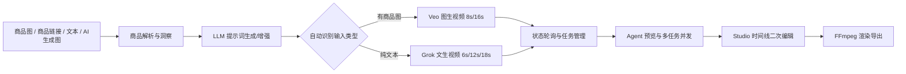
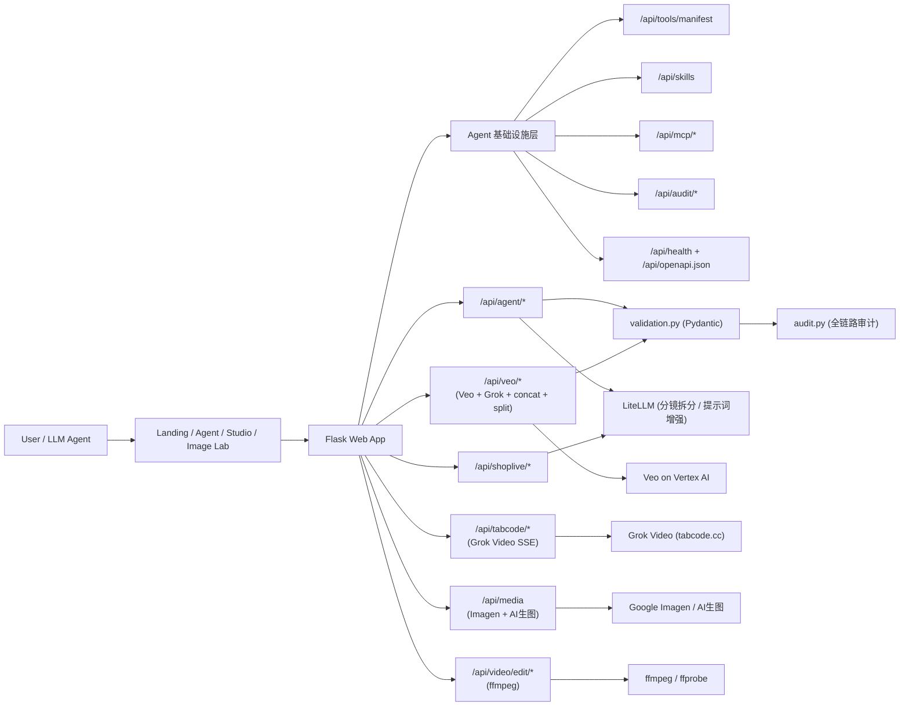

# Shoplive

> 面向电商营销的 AI 视频生成与编辑工作台。
> 从"商品理解"到"成片导出"，一套系统走完整链路。


[English README](./README.en.md) | 简体中文（当前）

Shoplive 是一个面向电商营销场景的开源 AI 视频生成与编辑工作台。
用户可以通过商品图、商品链接或文本提示词，快速完成「商品理解 → 提示词生成 → 视频生成 → 在线二次编辑导出」的完整链路。

---

## 目录

- [为什么是 Shoplive](#为什么是-shoplive)
- [核心能力](#核心能力)
- [功能矩阵](#功能矩阵)
- [端到端流程总览](#端到端流程总览)
- [技术架构](#技术架构)
- [项目结构](#项目结构)
- [环境要求](#环境要求)
- [快速开始](#快速开始)
- [Agent 使用说明](#agent-使用说明)
- [视频生成模式](#视频生成模式)
- [关键接口速览](#关键接口速览)
- [接口调用示例](#接口调用示例)
- [运行测试](#运行测试)
- [演示流程（推荐）](#演示流程推荐)
- [常见问题](#常见问题)
- [部署与安全建议](#部署与安全建议)
- [贡献指南](#贡献指南)
- [Roadmap](#roadmap)
- [许可证](#许可证)

---

## 为什么是 Shoplive

- **端到端闭环**：不是单点"文生视频"，而是"解析商品 → 生成 → 编辑 → 导出"的完整生产链路
- **多模型支持（自动路由）**：同时支持 Google Veo 与 Grok Video，系统按输入自动选择链路（有商品图优先 Veo 图生视频；纯文本走 Grok 文生视频）
- **LLM 分镜拆分**：多段视频（12s/16s/18s）使用 LLM 自动拆分不同叙事场景，消除拼接重复
- **工程化可观测**：Pydantic 边界校验、审计追踪（trace_id）、健康检查、OpenAPI 自动同步
- **多入口协作**：Landing / Agent / Studio / Image Lab 分工明确，适合演示与真实运营
- **兼顾体验与稳定性**：流式输出、轮询退避、任务并发、拼接失败明确提示、关键步骤 try/finally 解锁
- **对 Agent 友好**：Tool Registry + Skills + MCP 适配，便于 LLM 发现能力并自动编排
- **自然语言视频编辑**：通过 `/api/agent/run` 用文字指令直接编辑视频，支持调速、调色、字幕样式、裁剪、批量指令、撤销，SSE 实时推送进度
- **即时预览 + 确认导出**：字幕/调色类编辑先通过 CSS overlay 即时预览，用户确认后再触发 ffmpeg 导出，减少无效渲染

---

## 核心能力

| 能力 | 说明 |
|------|------|
| 商品信息解析 | 支持图片与商品链接提取商品名、卖点、风格等，自动填入提示词 |
| 主流电商抓取 | requests + Playwright 双引擎，支持 10+ 平台（Amazon、Shein、淘宝、京东等） |
| 智能提示词 | 自动生成/增强 Veo/Grok 可用的电商视频提示词，支持 LLM 增强 |
| AI 参考图生成 | 三字段表单（模特地区/主营品类/风格）+ LLM prompt 工程，生成高质量商品图 |
| 视频生成 | Veo 8s/16s + Grok 6s/12s/18s，LLM 分镜拆分，ffmpeg 智能音频兼容拼接 |
| 二次编辑 | 调色、变速、文字蒙版（支持自定义字幕颜色/位置）、BGM 混音后导出 |
| **Agent 对话编辑视频** | 自然语言直接操控视频：调速（全局/分段）、调色、字幕添加与样式、视频裁剪、BGM 管理、批量指令、撤销回退、即时预览 |
| Agent Tools 基础设施 | Pydantic 校验、Tool Registry、Skills 技能编排、MCP 协议、全链路审计 |

---

## 功能矩阵

| 模块 | 能力 | 当前状态 |
|------|------|---------|
| Landing | AI 商品图生成（三字段表单）、上传参考图、「生成视频→」直通 Agent、工作台式 Prompt 输入区、宽屏 Hero 视觉卡片 | ✅ 可用 |
| Agent | 商品洞察、提示词增强、多模型视频生成、并发任务跟踪、弹窗选图、**自然语言编辑视频**、三栏工作区 | ✅ 可用 |
| Studio | 时间线编辑、异步渲染、进度/取消、统计与优化建议 | ✅ 可用 |
| Image Lab | 商品相关生图与管线衔接 | ✅ 可用 |
| Backend API | Veo / Grok / Shoplive / Agent / Media / Video Edit 全链路接口 | ✅ 可用 |
| Agent Infra | Tool Registry / Skills / MCP / Audit / OpenAPI | ✅ 可用 |

---

## 端到端流程总览



---

## 技术架构



---

## 项目结构

```text
shoplive/
├── README.md
├── LICENSE                      # MIT 开源协议
├── conftest.py                  # pytest sys.path 配置
├── requirements.txt
├── .env.example                 # 环境变量示例
├── backend/
│   ├── run.py                   # 启动入口
│   ├── app_factory.py           # 应用工厂
│   ├── web_app.py               # Flask 主应用 + 路由注册
│   ├── briefing.py              # 业务规则、脚本与提示词编排
│   ├── infra.py                 # 鉴权、代理、公共参数解析
│   ├── schemas.py               # Pydantic 请求验证模型
│   ├── validation.py            # validate_request 装饰器
│   ├── audit.py                 # 全链路审计（AuditLogger）
│   ├── tool_registry.py         # LLM 友好工具注册表
│   ├── skills.py                # 技能编排层
│   ├── mcp_adapter.py           # MCP JSON-RPC 协议适配器
│   ├── async_executor.py        # ThreadPoolExecutor 并行执行
│   ├── common/
│   │   └── helpers.py           # 通用工具（LLM 调用、分镜拆分、ffmpeg 拼接、GCS）
│   ├── api/
│   │   ├── agent_api.py         # 商品洞察、Agent 对话
│   │   ├── shoplive_api.py      # 视频工作流（脚本/提示词）
│   │   ├── veo_api.py           # Veo/Grok 任务提交、状态查询、拼接、分镜生成
│   │   ├── media_api.py         # 生图与组合管线（含 LLM prompt 工程）
│   │   ├── video_edit_api.py    # ffmpeg 导出接口
│   │   └── tabcode_api.py       # Grok Video SSE 流式接口
│   ├── scraper/                 # 电商链接抓取与解析
│   │   ├── fetchers.py          # requests / Playwright 双引擎
│   │   ├── models.py            # FetchArtifact / ParseResult
│   │   └── adapters/            # 平台适配器（10+ 平台）
│   └── tests/
│       ├── test_schemas.py           # Pydantic schema 测试（45 tests）
│       ├── test_audit.py             # 审计日志测试（23 tests）
│       ├── test_validation.py        # 验证装饰器测试（23 tests）
│       ├── test_helpers_timeline.py  # 时间线片段测试（6 tests）
│       ├── test_optimizations.py     # 系统优化测试（19 tests）
│       ├── test_video_edit_api.py    # 视频编辑 API 测试（含异步任务队列）
│       └── test_agent_run.py         # Agent Run 端到端测试（34 tests）
├── video_edits/                 # 导出视频存储目录（运行时自动创建）
└── frontend/
    ├── pages/                   # 多页面入口（index / agent / studio / image-lab）
    ├── scripts/                 # entry / modules / shared
    ├── styles/                  # 各页面样式（含 ref-modal、AI表单、卡片系统）
    └── assets/                  # 静态素材
```

---

## 环境要求

- Python `3.10+`
- `ffmpeg` 和 `ffprobe`（视频拼接/导出必需）
- Playwright Chromium（商品页面 JS 渲染抓取）
- Google Cloud 凭据（Veo / Imagen）
- LiteLLM API Key（提示词增强、分镜拆分、AI 生图 prompt 工程）

---

## 快速开始

### 1. 克隆仓库

```bash
git clone https://github.com/your-org/shoplive.git
cd shoplive
```

### 2. 安装依赖

```bash
python3 -m venv .venv
source .venv/bin/activate
pip install -U pip
pip install -r requirements.txt
playwright install chromium
```

### 3. 配置环境变量

```bash
cp .env.example .env
```

编辑 `.env`，关键配置项：

| 变量名 | 必填 | 说明 |
|--------|------|------|
| `LITELLM_API_KEY` | ✅ | 文本模型密钥（分镜拆分、提示词增强等） |
| `LITELLM_API_BASE` | 否 | LiteLLM 服务地址 |
| `LITELLM_MODEL` | 否 | 默认文本模型名（如 `bedrock-claude-4-5-haiku`） |
| `GOOGLE_APPLICATION_CREDENTIALS` | 否 | Google 服务账号 JSON 路径 |
| `TABCODE_API_KEY` | 否 | Grok Video 调用密钥（使用 Grok 模型时需要） |
| `TABCODE_API_BASE` | 否 | Grok Video 服务地址 |
| `HOST` | 否 | Flask 监听地址，默认 `127.0.0.1` |
| `PORT` | 否 | Flask 监听端口，默认 `8000` |
| `DEBUG` | 否 | 调试开关，默认开启 |

### 4. 启动服务

```bash
python3 backend/run.py
```

自定义端口：

```bash
PORT=8010 python3 backend/run.py
```

默认地址：`http://127.0.0.1:8000`

> `backend/run.py` 会自动将项目根目录加入 `sys.path`，无需切换到父级目录运行。

### 5. 打开页面

| 页面 | 地址 | 说明 |
|------|------|------|
| Landing | `/` | 入口页，AI 生图、上传参考图、工作台式 Prompt 输入区、直通 Agent |
| Agent | `/pages/agent.html` | 主工作台，视频生成全流程、三栏编辑工作区 |
| Studio | `/pages/studio.html` | 时间线编辑器 |
| Image Lab | `/pages/image-lab.html` | 生图管线 |

---

## Agent 使用说明

以下说明对应当前 Agent 页面默认行为（无需手动切模型）。

### 1) 自动模型路由

- **有商品图（上传图 / 链接解析出图 / AI 生图）**：默认走 **Veo 图生视频**，优先保证商品一致性
- **只有文本**：默认走 **Grok 文生视频**
- 页面已移除手动模型选择控件，避免误配

### 2) Prompt 配置确认弹窗

在发送生成请求前，系统会尝试从提示词里识别：

- 视频比例（如 `9:16`、`16:9`）
- 视频时长（如 `8s`、`12秒`）

并弹出确认卡片：

- **确认并生成**：按识别结果直接开跑
- **先编辑设置**：回到面板手动调整后再生成

> 时长会按当前自动路由模型可用档位做归一化（就近映射），避免提交不可用时长。

### 3) 视频编辑（分段生效）

视频编辑器中的蒙版/调色/BGM/运动轨道支持分段操作（按关键帧区间生效）：

- 每两个关键帧构成一个生效区间
- 点击轨道空白两次可直接创建一段
- 或按住 **Shift** 拖拽一次创建一段
- 首击后可用 **Enter** 确认、**Esc** 取消
- 播放头与预览视频时间双向同步（拖播放头会同步预览；播放预览也会更新播放头）

### 4) 自然语言快速调速

在对话框输入类似：

- `视频1.5倍速`
- `把这个视频改成 0.75x`

系统会对**当前视频**走导出链路执行速度编辑，不会新建一次生成任务。

---

## 界面体验亮点

### Landing 首页

- 首页 Hero 已针对大屏重新平衡比例，左侧文案、右侧视觉卡片与底部工作台输入区对齐
- 右侧三张悬浮卡片保留原结构，但增强了漂浮动画、玻璃质感、扫光和空间层次
- Prompt 输入区采用更强的工作台式视觉，突出「参考图 + Prompt + 生成」这一主路径

### Agent 工作区

- 默认保持**聊天预览优先**：视频生成后先在对话区直接预览，不会自动压缩成三栏
- 「编辑视频 / 编辑脚本」仅在视频卡下方以小按钮出现，点击后才进入双栏/三栏编辑工作区
- 聊天区、分镜脚本、视频编辑支持稳定的双栏/三栏工作区切换
- 三栏模式下三列顶部和底部对齐，聊天列保持独立滚动，不会因切换编辑器导致整页跳动
- 点击某个视频卡进入编辑时，会尽量锚定在当前视频结果附近，便于边看结果边改脚本/后处理
- 对话区输入栏采用 sticky workbench 形态，适合长对话和连续调参
- 系统反馈已统一为显式三通道：`pushSystemStateMsg / pushSystemGuideMsg / pushSystemReplyMsg`
- `summary-actions / editor-actions / video-actions` 已统一为 action pill 体系，并规范 hover/focus/disabled/loading 四态

### 视频编辑时间轴

- 关键帧按"每两个点形成一个生效区间"的方式工作，更接近剪映类分段编辑
- 支持点击轨道空白两次快速建段
- 支持 `Shift + 拖拽` 一次建段
- 支持 `Enter` 确认、`Esc` 取消，并带有轻量提示反馈

---

## 视频生成模式

### Veo 模型（Google Vertex AI）

| 模式 | 接口 | 时长 | 说明 |
|------|------|------|------|
| 单次生成 | `/api/veo/start` | 4–15s | 支持文生视频、图生视频（首帧/尾帧）、参考图风格 |
| 链式延展 | `/api/veo/chain` | 8/16/24s | 自动链式扩展，种子一致性保证 |
| LLM 分镜并行 | `/api/veo/generate-16s` | 16s | LLM 拆分为两段不同叙事 prompt，并行生成后拼接 |
| 状态查询 | `/api/veo/status` | — | 轮询任务状态，含指数退避重试 |
| 抽帧 | `/api/veo/extract-frame` | — | 提取视频首/尾帧，用于帧衔接 |
| 拼接 | `/api/veo/concat-segments` | — | ffmpeg 智能音频兼容拼接，返回 HTTP URL |

**支持模型**：`veo-3.1-generate-preview` / `veo-3.1-fast-generate-001` / `veo-2.0-generate-001`

### Grok Video（tabcode.cc）

| 时长选项 | 实现方式 |
|---------|---------|
| 6s（单次） | 直接生成 |
| 12s（2段拼接） | LLM 拆分为 2 个不同分镜 prompt，串行生成后拼接 |
| 18s（3段拼接） | LLM 拆分为 3 个不同分镜 prompt，串行生成后拼接 |

### LLM 分镜拆分策略

所有多段视频均使用统一的三步 Chain-of-Thought 提示词拆分：

1. **STEP 1 – 视觉锚点提取**：锁定商品外观、风格、灯光、色调、镜头语言，所有段落必须继承
2. **STEP 2 – 叙事角色分配**：第1段=英雄开场（产品推进），第2段=使用/情感收尾（不同角度）
3. **STEP 3 – 生成各段 prompt**：以视觉锚点开头 + 当前段专属动作，带时间戳镜头指引

LLM 失败时走智能 fallback（结构化场景模板，各段内容不同，绝不重复）。

---

## 关键接口速览

### Veo 生成

| 端点 | 方法 | 说明 |
|------|------|------|
| `/api/veo/start` | POST | 提交生成任务（text/image/reference/frame 模式） |
| `/api/veo/status` | POST | 查询任务状态（含指数退避重试） |
| `/api/veo/chain` | POST | 链式扩展生成（8/16/24s），支持 `async_mode=true` 返回 202 + job_id |
| `/api/veo/chain/status` | GET | 查询异步 chain 任务状态 |
| `/api/veo/extend` | POST | 基于已有视频做单次延展 |
| `/api/veo/generate-16s` | POST | LLM 分镜并行生成 16s |
| `/api/veo/generate-12s` | POST | LLM 分镜并行生成 12s（适用 Grok） |
| `/api/veo/concat-segments` | POST | 拼接两段视频（GCS/data URL/HTTP），返回 video_url |
| `/api/veo/extract-frame` | POST | 提取视频帧（first/last/指定秒数） |
| `/api/veo/play` | GET | GCS 视频流式代理播放 |

### Grok Video

| 端点 | 方法 | 说明 |
|------|------|------|
| `/api/tabcode/video/generate` | POST | SSE 流式生成，返回进度 + 视频 URL |
| `/api/tabcode/models` | GET | 可用模型列表 |

### Agent & 商品洞察

| 端点 | 方法 | 说明 |
|------|------|------|
| `/api/agent/shop-product-insight` | POST | 商品链接解析（10+ 平台） |
| `/api/agent/image-insight` | POST | 商品图识别与卖点提取 |
| `/api/agent/chat` | POST | LLM 对话（支持 `stream=true` SSE） |
| `/api/agent/run` | POST | **Agent 自然语言执行**：LLM 理解指令 → 自动调用工具 → SSE 流式进度（调速/调色/文字/时间线） |

### 生图

| 端点 | 方法 | 说明 |
|------|------|------|
| `/api/shoplive/image/generate` | POST | AI 商品图生成（LLM prompt 工程 + Imagen，自动类别校验重试） |
| `/api/google-image/generate` | POST | 直接调用 Google Imagen |

### 工作流

| 端点 | 方法 | 说明 |
|------|------|------|
| `/api/shoplive/video/workflow` | POST | 脚本生成 / 提示词构建（validate/generate_script/build_export_prompt） |
| `/api/shoplive/video/prompt` | POST | 单步提示词生成 |

### 视频编辑

| 端点 | 方法 | 说明 |
|------|------|------|
| `/api/video/edit/export` | POST | 调色/变速/文字蒙版/BGM 混音导出 |
| `/api/video/timeline/render` | POST | 时间线片段渲染导出（异步） |
| `/api/video/timeline/render/status` | GET | 查询渲染任务状态 |
| `/api/video/timeline/render/cancel` | POST | 取消渲染任务 |
| `/video-edits/<filename>` | GET | 导出视频访问 |

### Agent 基础设施

| 端点 | 方法 | 说明 |
|------|------|------|
| `/api/tools/manifest` | GET | LLM 工具清单（支持 `?skill=` / `?tags=` 筛选） |
| `/api/skills` | GET | 技能摘要列表 |
| `/api/skills/<id>` | GET | 完整技能定义 + 操作说明书 |
| `/api/mcp/tools` | GET | MCP 协议工具列表 |
| `/api/mcp/rpc` | POST | MCP JSON-RPC 调用入口 |
| `/api/audit/stats` | GET | 全链路调用统计 |
| `/api/audit/recent` | GET | 最近 N 条审计记录 |
| `/api/health` | GET | 服务健康检查 + 组件状态 |
| `/api/openapi.json` | GET | 自动生成的 OpenAPI 3.0.3 规范 |

---

## 接口调用示例

### 提交 Veo 任务

```bash
curl -sS -X POST "http://127.0.0.1:8000/api/veo/start" \
  -H "Content-Type: application/json" \
  -d '{
    "project_id": "your-project-id",
    "model": "veo-3.1-fast-generate-001",
    "prompt": "一条连衣裙的电商展示视频，自然光棚拍，镜头从宽景推至细节特写",
    "veo_mode": "text",
    "duration_seconds": 8,
    "aspect_ratio": "16:9"
  }'
```

### 查询状态

```bash
curl -sS -X POST "http://127.0.0.1:8000/api/veo/status" \
  -H "Content-Type: application/json" \
  -d '{
    "project_id": "your-project-id",
    "model": "veo-3.1-fast-generate-001",
    "operation_name": "<start 接口返回的 operation_name>"
  }'
```

### LLM 分镜并行生成 16s

```bash
curl -sS -X POST "http://127.0.0.1:8000/api/veo/generate-16s" \
  -H "Content-Type: application/json" \
  -d '{
    "project_id": "your-project-id",
    "prompt": "黑色运动鞋电商广告，极简风格，突出鞋底科技感与材质细节",
    "aspect_ratio": "16:9",
    "storage_uri": "gs://your-bucket/veo-output/"
  }'
```

响应包含 `video_url`（HTTP 直链）和 `video_data_url`（base64，向后兼容）。

### AI 商品图生成

```bash
curl -sS -X POST "http://127.0.0.1:8000/api/shoplive/image/generate" \
  -H "Content-Type: application/json" \
  -d '{
    "product_name": "黑色真皮运动鞋",
    "main_category": "运动鞋",
    "selling_region": "欧美",
    "brand_philosophy": "街头潮流风格",
    "sample_count": 1
  }'
```

### 拼接两段视频

```bash
curl -sS -X POST "http://127.0.0.1:8000/api/veo/concat-segments" \
  -H "Content-Type: application/json" \
  -d '{
    "project_id": "your-project-id",
    "gcs_uri_a": "gs://your-bucket/seg_a.mp4",
    "gcs_uri_b": "gs://your-bucket/seg_b.mp4"
  }'
```

响应：`{ "ok": true, "video_url": "http://127.0.0.1:8000/video-edits/concat-xxx.mp4", "video_data_url": "data:video/mp4;base64,..." }`

### Agent 自然语言编辑视频

```bash
# 将视频加速 2 倍，底部加文字
curl -sS -X POST "http://127.0.0.1:8000/api/agent/run" \
  -H "Content-Type: application/json" \
  -d '{
    "prompt": "将这个视频加速2倍，并在底部加上文字「限时特卖 8折优惠」",
    "context": {
      "video_url": "http://127.0.0.1:8000/video-edits/my-video.mp4"
    }
  }'
```

响应为 SSE 流：每条 `data:` 含 `{"event": "tool_call"|"tool_result"|"done"|"error", ...}`。
最终 `done` 事件包含 `result.video_url`（可直接播放的导出链接）。

### 服务健康检查

```bash
curl "http://127.0.0.1:8000/api/health"
```

---

## 运行测试

```bash
pip install pytest
python3 -m pytest backend/tests/ -v
```

| 文件 | 测试数 | 覆盖内容 |
|------|--------|---------|
| `test_schemas.py` | 45 | Pydantic schema 枚举、边界、必填校验 |
| `test_audit.py` | 23 | AuditLogger buffer/stats/trace/线程安全 |
| `test_validation.py` | 23 | validate_request 装饰器 13 种错误路径 |
| `test_helpers_timeline.py` | 6 | 时间线片段归一化、边界过滤 |
| `test_optimizations.py` | 19 | LRU 缓存、共享线程池、初始等待跳过、队列 TTL 清理 |
| `test_video_edit_api.py` | — | ffmpeg 导出、异步时间线渲染、任务队列满载驱逐 |
| `test_agent_run.py` | 34 | Agent Run SSE：单轮/多轮 tool-call、超时、JSON 解析错误、未知工具 |

---

## 演示流程（推荐）

1. 打开 Landing（`/`），在 AI 生成面板填写「欧美 / 连衣裙 / 法式优雅」，生成参考图
2. 也可以直接在首页工作台输入 Prompt，或点击参考图上的「生成视频 →」按钮跳转 Agent 并导入图片
3. Agent 自动识别商品信息、填充提示词
4. 直接输入提示词并点击「生成视频」（系统会按输入自动路由模型）
5. 视频生成完毕后，可在三栏工作区中点击「编辑视频」或「编辑脚本」继续修改
6. 导出并获取可访问链接

---

## 常见问题

**Q: 生成成功但无法播放？**
A: 检查 `/api/veo/status` 返回中的 `signed_video_urls` 与 `inline_videos`；GCS 403 通常是权限不足。

**Q: ffmpeg 拼接失败？**
A: 确认已安装 `ffmpeg` 和 `ffprobe`（`ffmpeg -version` 验证）。音频不兼容时系统会自动转码，但若 ffprobe 不在 PATH 则退化到保守重编码模式。

**Q: 文字蒙版未生效？**
A: 系统 ffmpeg 可能编译时未包含 `libfreetype`（`drawtext` 需要）。解决方案：

```bash
brew install ffmpeg-full   # 含 drawtext/libfreetype
```

服务启动时会自动检测并优先使用 `ffmpeg-full`（PATH 自动注入），无需额外配置。

**Q: Grok 视频每段都一样？**
A: 已在前端加入 LLM 分镜拆分（`_splitPromptForGrok`），每段使用不同叙事场景的 prompt。若 LLM 调用失败会走结构化 fallback（3 种场景模板各不相同）。

**Q: 为什么看不到模型选择了？**
A: Agent 已改为自动路由：有商品图优先 Veo 图生视频，纯文本走 Grok 文生视频。这样可以减少错误配置并提升商品一致性。

**Q: 多段视频拼接后有音频跳跃？**
A: ffmpeg 拼接前会 ffprobe 检测各段音频参数，不一致时自动统一转码为 AAC 44100Hz 立体声。

**Q: 商品链接解析质量低？**
A: 查看返回的 `fallback_reason`，`anti_bot` 或 `weak_html` 建议更换代理或稍后重试。

---

## 部署与安全建议

- 请勿将 `.env`、凭据文件、私钥提交到代码仓库（已在 `.gitignore` 中排除）
- 生产环境建议将密钥由密钥管理服务注入，不直接落盘
- 建议在 API 网关层增加鉴权与限流，避免接口滥用
- 对外部署时建议使用最小权限服务账号，并定期轮换密钥
- `video_edits/` 目录存放用户生成内容，生产环境建议挂载独立存储卷

---

## 贡献指南

欢迎提交 PR 和 Issue！参与贡献请遵循以下规范：

1. **Fork** 本仓库，从 `main` 分支创建功能分支（`git checkout -b feat/your-feature`）
2. **代码风格**：Python 遵循 PEP 8，JS 遵循项目现有风格（无构建工具，原生 ES6+）
3. **测试**：新增后端逻辑请同步补充测试，确保 `python3 -m pytest backend/tests/ -v` 全部通过
4. **提交信息**：使用清晰的中英文描述，说明改动原因而非改动内容
5. **PR 描述**：简述改动目标、测试方法、是否有破坏性变更
6. 对于较大的功能性变更，建议先开 Issue 讨论方案再开始实现

如发现安全漏洞，请**不要**公开 Issue，直接通过邮件联系维护者。

---

## Roadmap

- [x] Agent 自然语言编辑视频（`/api/agent/run` SSE）
- [x] Veo chain 异步模式（`async_mode=true` + `/api/veo/chain/status`）
- [x] ffmpeg-full 自动检测与 drawtext 支持
- [x] 时间线任务队列满载驱逐（TTL + 200 条上限）
- [x] GCS signing 失败显式返回 `sign_error`（不再静默丢失）
- [x] Agent 自动模型路由（有商品图→Veo；纯文本→Grok）
- [x] Prompt 配置确认弹窗（比例/时长识别 + 确认/编辑）
- [x] 视频编辑时间轴分段生效 + 双击/Shift 拖拽建段 + Enter/Esc 快捷操作
- [x] Landing 首页大屏比例与工作台式 Prompt 输入区优化
- [x] Agent 三栏工作区对齐、聊天锚点保持与 sticky 对话工作台
- [ ] Veo SSE 链式流式状态推送（`/api/veo/chain/stream?job_id=xxx`）
- [ ] Studio 时间线升级为可插拔渲染后端（ffmpeg / cloud render）
- [ ] 任务中心完善（筛选、重试、失败诊断）
- [ ] Docker / Docker Compose 标准化部署
- [ ] 多语言提示词优化（英/日/阿拉伯语市场）

---

## 许可证

本项目基于 [MIT License](./LICENSE) 开源。

```
MIT License

Copyright (c) 2025 Shoplive Contributors

Permission is hereby granted, free of charge, to any person obtaining a copy
of this software and associated documentation files (the "Software"), to deal
in the Software without restriction, including without limitation the rights
to use, copy, modify, merge, publish, distribute, sublicense, and/or sell
copies of the Software, and to permit persons to whom the Software is
furnished to do so, subject to the following conditions:

The above copyright notice and this permission notice shall be included in all
copies or substantial portions of the Software.

THE SOFTWARE IS PROVIDED "AS IS", WITHOUT WARRANTY OF ANY KIND, EXPRESS OR
IMPLIED, INCLUDING BUT NOT LIMITED TO THE WARRANTIES OF MERCHANTABILITY,
FITNESS FOR A PARTICULAR PURPOSE AND NONINFRINGEMENT. IN NO EVENT SHALL THE
AUTHORS OR COPYRIGHT HOLDERS BE LIABLE FOR ANY CLAIM, DAMAGES OR OTHER
LIABILITY, WHETHER IN AN ACTION OF CONTRACT, TORT OR OTHERWISE, ARISING FROM,
OUT OF OR IN CONNECTION WITH THE SOFTWARE OR THE USE OR OTHER DEALINGS IN THE
SOFTWARE.
```
