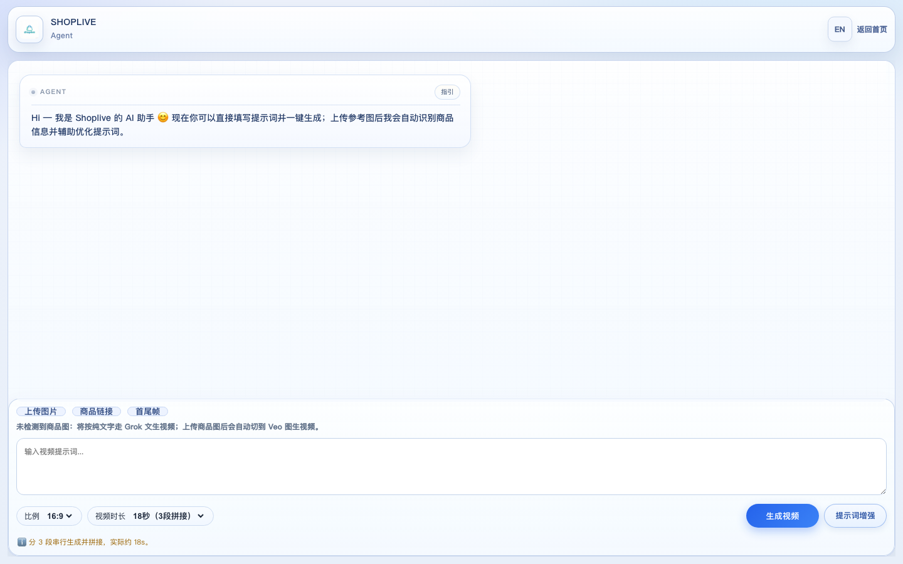
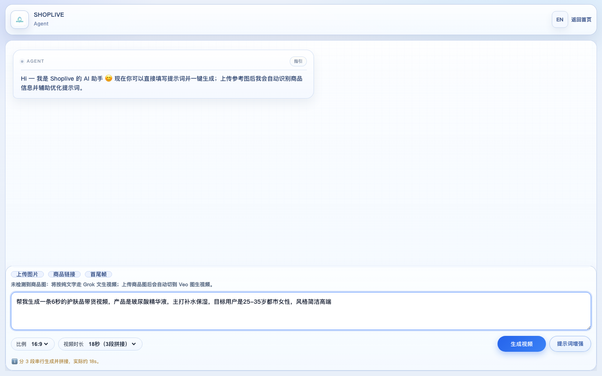
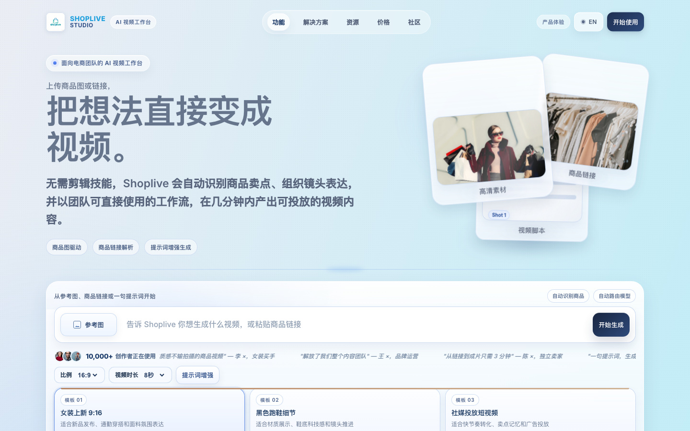
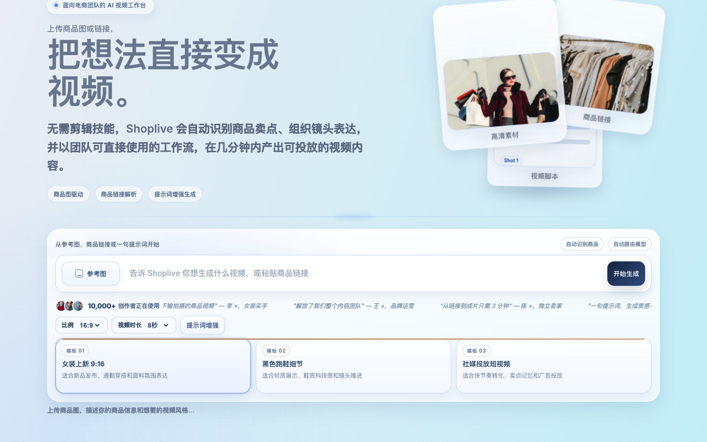
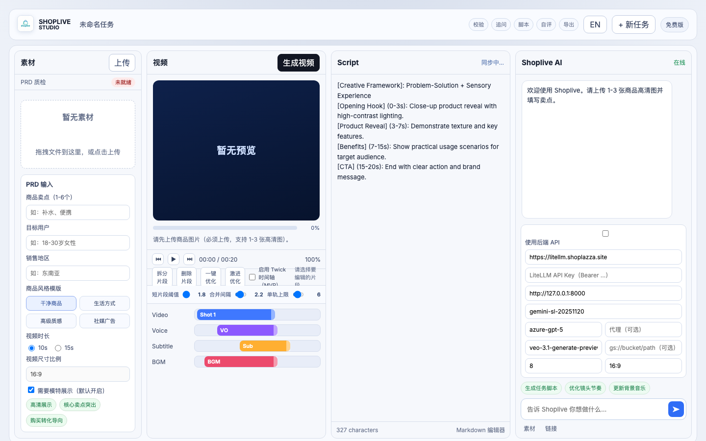
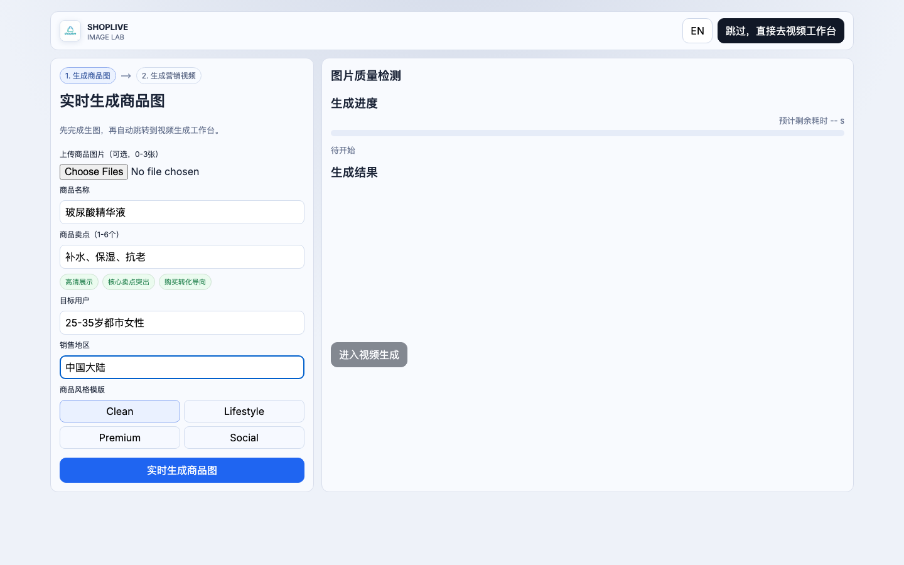
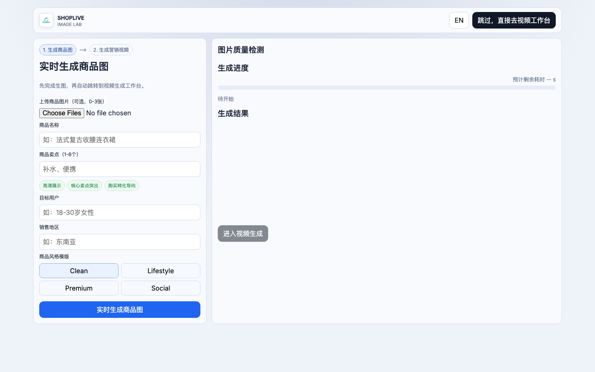

# Shoplive 系统操作截图说明

Shoplive 提供三条主要路径生成带货视频：**文生视频**、**图生视频（用户上传）**、**图生视频（AI 生成商品图）**。

---

## 路径一：文生视频

直接在 Agent 工作台输入自然语言描述，AI 自动生成脚本并调用 Veo 生成视频。

### 第 1 步 · 打开 Agent 工作台

访问首页后点击「进入工作台」，进入 AI Agent 对话界面。界面顶部显示当前配置（时长、画幅、视频模型），底部为对话输入区和快捷操作栏。

### 第 2 步 · 输入视频描述

在底部输入框中直接用自然语言描述视频需求，包含商品名称、卖点、目标用户、时长、风格等信息，点击「生成视频」按钮提交。

> **示例 Prompt：**
> 帮我生成一条 6 秒的护肤品带货视频，产品是玻尿酸精华液，主打补水保湿，目标用户是 25-35 岁都市女性，风格简洁高端

### 第 3 步 · 等待生成，查看结果

Agent 依次完成：解析意图 → 生成分镜脚本 → 构建 Veo Prompt → 调用 Veo 生成视频。进度实时显示在对话流中，完成后视频卡片出现在聊天区，可直接播放或进入编辑。

### 第 4 步 · 自然语言编辑（可选）

对生成结果直接输入编辑指令，Agent 自动调用 FFmpeg 完成处理并返回新视频：

| 编辑指令示例 | 效果 |
|-------------|------|
| `加速1.5倍` | 视频播放加速至 1.5x |
| `第2秒加字幕：限时特卖` | 在第 2 秒叠加文字 |
| `提亮画面` | 饱和度 + 亮度调整 |
| `裁剪前3秒` | 截取片段 |

也可点击底部快捷操作栏直接触发高频操作。

---

## 路径二：图生视频（用户上传商品图）

上传自有商品图片，AI 分析图片内容后生成匹配的带货视频。

### 第 1 步 · 访问 Landing 首页

打开首页，可以看到商品上传区（支持拖拽上传商品图）、Prompt 工作台入口，以及底部的功能说明和示例卡片。

### 第 2 步 · 上传商品图进入工作流

在首页上传区拖入或点击上传 1-3 张商品图（建议宽高 ≥ 1024px，主体占比 ≥ 40%），系统自动调用 Gemini Vision 分析图片，提取商品名称、品类、卖点，跳转至视频工作室。

### 第 3 步 · 在视频工作室补充 Brief

进入 Studio 后，AI 预填了从图片中识别到的商品信息。在左侧表单中确认或补充：目标用户、销售地区、时长、风格模版，中间预览区显示当前配置，右侧 Shoplive AI 面板提供 Prompt 优化建议。

### 第 4 步 · 生成脚本与视频

点击「生成脚本」，AI 根据 Brief 输出分镜脚本；确认后点击「生成视频」，调用 Veo 生成带货视频，支持 8s 单段或 16s / 24s 链式拼接。

---

## 路径三：图生视频（AI 生成商品图）

无现成商品图时，先用 Imagen 生成一张符合品类调性的商品参考图，再以此图为视觉锚点生成视频。

### 第 1 步 · 打开 Image Lab

点击首页「AI 生成商品图」或导航栏「Image Lab」，进入商品图生成界面。页面分为左侧参数表单和右侧生成结果区。

### 第 2 步 · 填写商品参数

在左侧表单填写四个字段，系统会自动做 Prompt 工程后交给 Imagen 出图：

| 字段 | 说明 | 示例 |
|------|------|------|
| 商品名称 | 产品名 | 玻尿酸精华液 |
| 商品卖点 | 1-6 个，逗号分隔 | 补水、保湿、抗老 |
| 目标用户 | 人群描述 | 25-35 岁都市女性 |
| 销售地区 | 市场地区 | 中国大陆 |

选择右侧风格模版（Clean / Lifestyle / Premium / Social），点击「实时生成商品图」。

### 第 3 步 · 查看生成图并跳转

右侧显示 Imagen 生成的商品参考图，同时进行图片质量检测（分辨率 / 锐度 / 主体占比）。确认满意后点击「进入视频生成」，商品图和 Brief 信息自动带入视频工作台。

### 第 4 步 · 在视频工作台生成视频

后续操作与路径二的第 3-4 步相同：补充 Brief → 生成脚本 → 生成视频。此时 Veo 会以 AI 商品图作为首帧参考，保证视频画面与商品图风格一致。

---

## 界面总览

| 页面 | 路径 | 核心功能 |
|------|------|---------|
| Landing 首页 | `/` | 商品图上传入口、Prompt 工作台导航、功能介绍 |
| Image Lab | `/pages/image-lab.html` | AI 生成商品参考图，两步式跳转视频 |
| Studio 工作室 | `/pages/studio.html` | 结构化 Brief 配置、脚本编辑、Veo 参数管理 |
| Agent 工作台 | `/pages/agent.html` | 对话式视频生成与编辑、自然语言编辑指令 |
